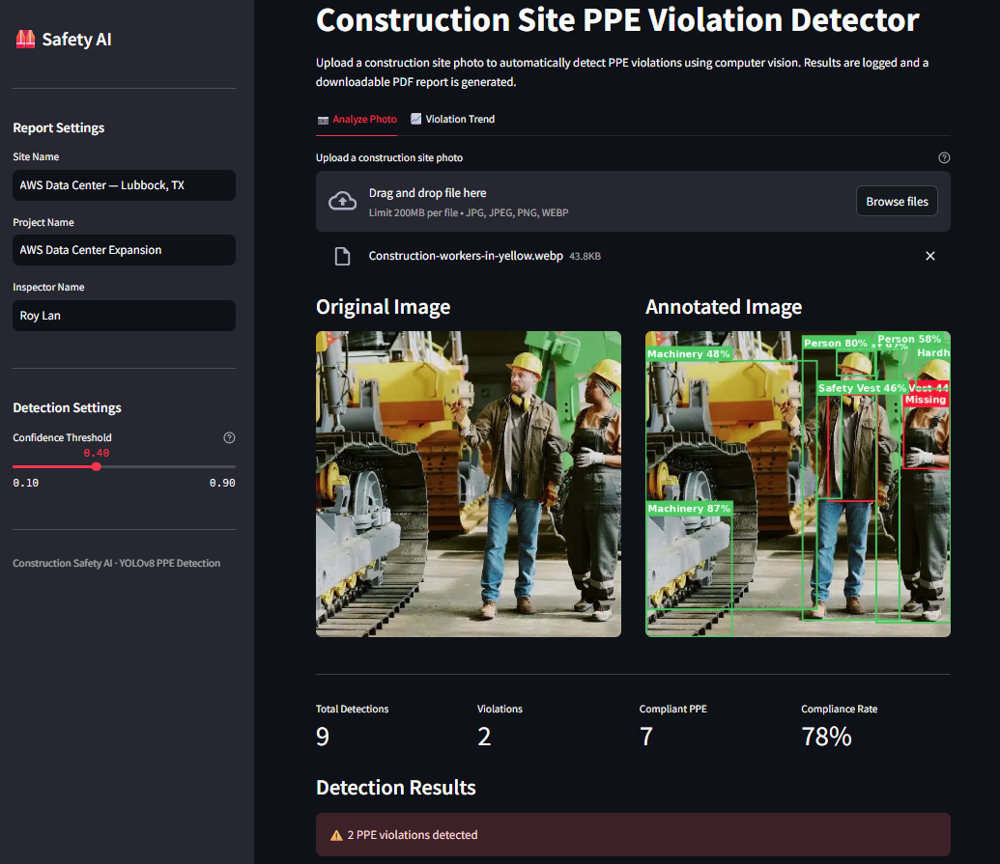
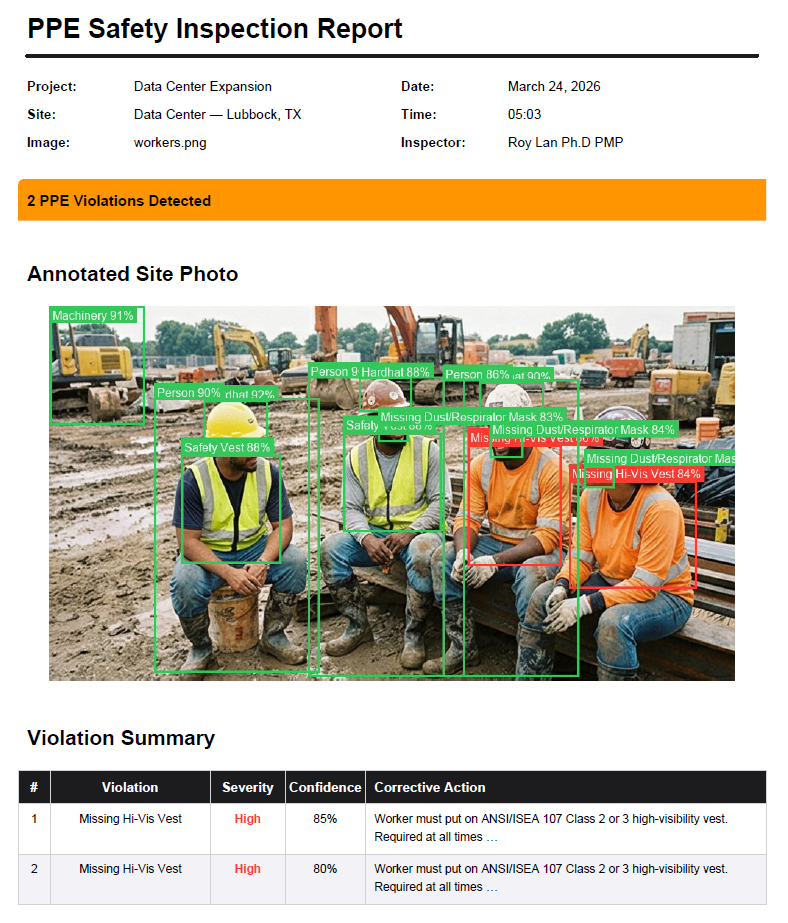
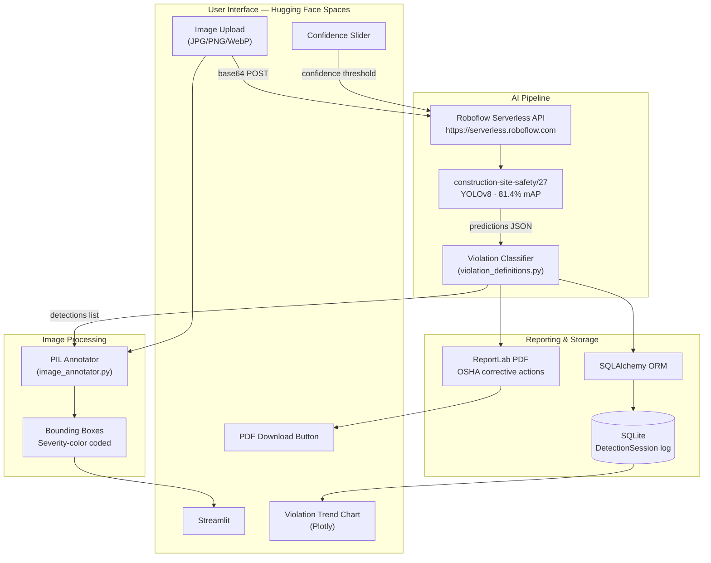
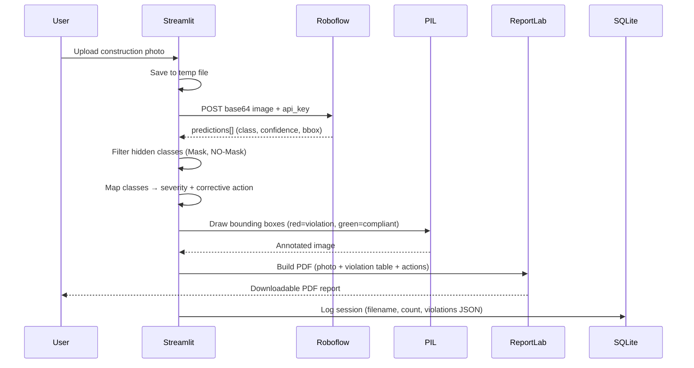

# Construction Safety AI

**Live demo:** https://delubobo-construction-safety-ai.hf.space

A computer vision tool that automatically detects PPE violations on construction sites using YOLOv8 via Roboflow cloud inference. Upload a photo — the app flags violations, draws bounding boxes, and generates a downloadable OSHA-aligned PDF safety report in seconds.

---

## Screenshots

### Upload & Detection


### Annotated Image with Bounding Boxes


### PDF Safety Report


### Violation Trend Chart


---

## Architecture



### Inference flow



---

## Tech stack

| Layer | Technology | Why |
|---|---|---|
| UI | Streamlit | Single Python file — model is the story, not the UI |
| CV Model | YOLOv8 (Roboflow cloud) | Zero GPU, zero download, works on HF Spaces free tier |
| Inference | Direct HTTP (`requests`) | Replaces heavy SDK — no torch/opencv build dependency |
| Image annotation | PIL (Pillow) | Headless bounding box drawing, no GUI dependency |
| PDF export | ReportLab | Zero native deps — works on Linux/Windows |
| Database | SQLite + SQLAlchemy | Session logging, persistent across container restarts |
| Charts | Plotly | Interactive violation trend over time |
| Hosting | Hugging Face Spaces | Free Streamlit hosting, auto-deploys from GitHub |

---

## Model details

| Property | Value |
|---|---|
| Model | `construction-site-safety/27` |
| Architecture | YOLOv8 |
| mAP | 81.4% |
| Inference | Roboflow Serverless (cloud, no GPU) |
| Violation classes | `NO-Hardhat`, `NO-Safety Vest` |
| Suppressed classes | `Mask`, `NO-Mask` (unreliable, hidden from output) |
| Default confidence | 0.35 (adjustable via sidebar slider) |

**Why cloud inference:** Free tier HF Spaces has no GPU and ~16GB RAM. Local YOLOv8 inference would require downloading model weights (~6MB) and compiling opencv on every cold start. Roboflow serverless eliminates all of that — the model is already hosted, the API call is a single HTTP POST.

**Why direct violation classes:** The model outputs `NO-Hardhat` and `NO-Safety Vest` directly — no spatial IoU logic needed to infer who is wearing what. Earlier approaches using person-PPE proximity were unreliable; this model architecture is the correct solution.

---

## OSHA alignment

Violations map directly to **OSHA 29 CFR 1926 Subpart E** (PPE requirements):

| Detection | OSHA Standard | Severity | Corrective Action |
|---|---|---|---|
| `NO-Hardhat` | 1926.100 | High | Immediate stop-work; issue ANSI Z89.1 Class E hard hat |
| `NO-Safety Vest` | 1926.201 | High | Issue ANSI/ISEA 107 Class 2/3 hi-vis vest before re-entry |

---

## Run locally

```bash
cd construction-safety-ai
py -3.12 -m venv venv
./venv/Scripts/activate        # Windows
# source venv/bin/activate     # Mac/Linux
pip install -r requirements.txt

# Create .env with your API key
echo "ROBOFLOW_API_KEY=your_key_here" > .env

streamlit run app/main.py
# → http://localhost:8501
```

---

## Deploy to Hugging Face Spaces

1. Create a new Space: SDK = Streamlit, Python = 3.12, Visibility = Public
2. **Settings → Repository Secrets → add `ROBOFLOW_API_KEY`**
3. Link to this GitHub repo → auto-deploys on push

---

## Project structure

```
construction-safety-ai/
├── README.md                          # HF Spaces config + docs
├── app.py                             # Root entry point (importlib loader)
├── app/
│   ├── main.py                        # Streamlit UI (upload → detect → report)
│   ├── database.py                    # SQLAlchemy DetectionSession model + log/query
│   └── utils/
│       ├── image_annotator.py         # PIL bounding box overlay (severity colors)
│       └── violation_definitions.py   # Class → label + severity + corrective action
├── model/
│   ├── detector.py                    # CloudPPEDetector (Roboflow HTTP client)
│   └── report_builder.py             # ReportLab PDF generator
├── tests/
│   └── test_detector.py
└── requirements.txt
```

---

## Future roadmap

| Version | Feature |
|---|---|
| v1.1 | Multi-image batch upload, violation severity scoring |
| v1.2 | Worker zone detection, real-time video frame analysis |
| v2.0 | AWS Rekognition Custom Labels, S3 archival, automated weekly safety report email |
